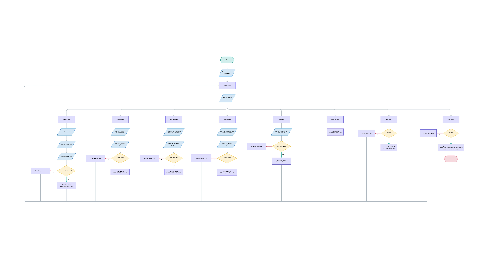

# Super Cashier
Super Cashier is a Final Project as part of Software and Data Engineering course in PACMANN. This project for **Introduction to Software and Data Engineering with Python I & II** modules.
# Table of Contents
- [Super Cashier](#super-cashier)
- [Table of Contents](#table-of-contents)
- [How to Install](#how-to-install)
	- [Background](#background)
	- [Requirements](#requirements)
	- [Flowchart](#flowchart)
	- [Code Explanation](#code-explanation)
	- [Test Case Results](#test-case-results)
	- [Conclusion](#conclusion)


[Back to Table of Contents ⬆️](#table-of-contents)

# How to Install
1. Clone project using git. Put this command into your terminal or CMD:
   ```shell
	git clone https://github.com/syaifulhuseinnn/SuperCashier.git
	 ```
	or download project as ZIP.
2. Enter to project folder using terminal or CMD. Use command:
   ```shell
	 cd SuperCashier
	 ```
3. If you're using Conda, first we need to create a new environment using `environment.yml` or `requirements.txt`	files generated by me. So your environment will be same with mine. Run this command if you want to use `environment.yml` file:
   ```shell
	 conda env create -f environment.yml
	 ```
	 If you want to use `requirements.txt` file instead, run this command:
	 ```shell
	 conda create --name <env_name> --file requirements.txt
	 ```
	 If you're not using Conda, maybe you only use pip which include in Python by default. Run this command:
	 ```shell
	 pip install -r requirements.txt
	 ```
4. Activate your a new environment you just created. If you're using Conda, run this command:
   ```shell
	 conda activate <env_name>
	 ```
5. Then, execute `main.py` file.

## Background
Andi adalah seorang pemilik supermarket besar di salah satu kota di Indonesia. Andi memiliki rencana untuk melakukan perbaikan proses bisnis, yaitu Andi akan membuat sistem kasir yang self-service di supermarket miliknya dengan harapan 
- Customer bisa langsung memasukkan item yang dibeli, jumlah item yang dibeli, dan harga item yang dibeli dan fitur yang lain.
- Customer yang tidak berada di kota tersebut bisa membeli barang dari supermarket tersebut.

[Back to Table of Contents ⬆️](#table-of-contents)


## Requirements
1. Customer dapat membuat ID Transaksi
   - Dengan membuat object dari function: `trnsct_123 = transaction()`
2. Customer dapat memasukkan nama item, jumlah item, dan harga item
   - Masukkan item yang ingin dibeli: `add_item([<nama item>, <jumlah item>, <harga per item>])`
3. Jika customer salah memasukkan nama item atau jumlah item atau harga item tetapi tidak ingin menghapusnya, customer dapat melakukan:
   -  Update nama item dengan method: `update_item_name(<nama item>, <update nama item>)`
   -  Update jumlah item: `update_item_qty(<nama_item>, <update jumlah item>)`
   -  Update harga item: `update_item_price(<nama_item>, <update harga item>)`
4. Jika customer batal membeli, customer dapat melakukan: 
   - Menghapus salah satu item: `delete_item(<nama item>)`
   - Menghapus semua transaksi sekaligus atau reset transaksi: `reset_transaction()`
5. Customer sudah selesai dengan berbelanja online nya, tetapi Customer masih ragu apakah harga barang dan nama barang yang diinput sudah benar. Bisa saja Customer melakukan kesalahan dalam melakukan input, semisal sudah melakukan input harga barang tetapi lupa untuk input nama barangnya. Andi bisa menggunakan method `check_order()`. Terdapat ketentuan:
   - Akan mengeluarkan pesan “Pemesanan sudah benar” (bebas bisa dengan message yang lain) jika tidak ada kesalahan input
   - Akan mengeluarkan pesan “Terdapat kesalahan input data” jika terjadi kesalahan input
   - Keluarkan output transaksi atau pemesanan apa saja yang sudah dibeli
6. Setelah melakukan pengecekan, Customer bisa menghitung total belanja yang sudah dibeli. Andi bisa menggunakan method check_out(). Pada supermarket ini ternyata terdapat ketentuan:
   - Jika total harga per item Andi diatas Rp 200.000 maka akan mendapatkan diskon 5%
   - Jika total harga per item Andi diatas Rp 300.000 maka akan mendapatkan diskon 6%
   - Jika total harga per item Andi diatas Rp 500.000 maka akan mendapatkan diskon 7%
   - Total pembelian hanya ditampilkan pada method check_out(), namun tidak di simpan di dalam database
7. Setiap kali method check_out() dijalankan, data transaksi dimasukkan ke dalam sqlite database pada tabel transaction menggunakan fungsi `insert_to_table(<source_data>)`
   - Kolom yang disimpan pada database
        - no_id 			: nomer id (auto increment)
     	- nama_item		: nama barang yang dibeli
   		- jumlah_item		: jumlah barang yang dibeli
   		- harga			: harga barang 
   		- total_harga		: total harga (jumlah item * harga)
   		- diskon			: potongan harga
   		- harga_diskon		: harga item setelah diskon

[Back to Table of Contents ⬆️](#table-of-contents)

## Flowchart


[Back to Table of Contents ⬆️](#table-of-contents)

## Code Explanation
Pada project ini saya menggunakan paradigma Object Oriented Programming. Script saya bagi menjadi modular code.

1. Script `SuperCashier.py` adalah sebuah class dengan beberapa method didalamnya.
   - `__init__`
   ```python
	def __init__(self):
        """
        Initializes a new instance of the SuperCashier class.
        """
	 ```
	 - `menus`
	```python
	def menus(self):
        """
        Displays the available menu options.
        """
	```
	- `transaction`
	```python
	def transaction(self):
        """
        Sets the transaction ID.
        """
	```
	- `add_item`
	```python
	def add_item(self, item_name, item_quantity, item_price):
        """
        Adds an item to the order.

        Args:
            item_name (str): The name of the item.
            item_quantity (int): The quantity of the item.
            item_price (int): The price of the item.
        """
	```
	- `update_item_name`
	```python
	def update_item_name(self, old_item_name, new_item_name):
        """
        Updates the name of an item in the order.

        Args:
            old_item_name (str): The current name of the item.
            new_item_name (str): The new name for the item.
        """
	```
	- `update_item_qty`
	```python
	def update_item_qty(self, item_name, new_item_qty):
        """
        Updates the quantity of an item in the order.

        Args:
            item_name (str): The name of the item.
            new_item_qty (int): The new quantity for the item.
        """
	```
	- `update_item_price`
	```python
	def update_item_price(self, item_name, new_item_price):
        """
        Updates the price of an item in the order.

        Args:
            item_name (str): The name of the item.
            new_item_price (int): The new price for the item.
        """
	```
	- `delete_item`
	```python
	def delete_item(self, item_name):
        """
        Deletes an item from the order.

        Args:
            item_name (str): The name of the item to delete.
        """
	```
	- `reset_transaction`
	```python
	def reset_transaction(self):
        """
        Resets the transaction by clearing the items in the order.
        """
	```
	- `check_order`
	```python
	def check_order(self):
        """
        Displays the items in the current order.
        """
	```
	- `check_out`
	```python
	def check_out(self):
        """
        Processes the checkout by calculating the total price, applying
        discounts, and inserting the transaction into the database.

        Returns:
            bool: False if item is empty.
        """
	```
	- `check_discount`
	```python
	def check_discount(self, total_price):
        """
        Checks if a discount is applicable based on the total price.

        Args:
            total_price (int): The total price of the items.

        Returns:
            dict or bool: A dictionary containing the discount and the total
            price after discount, or False if no discount is applicable.
        """
	```
	- `insert_to_table`
	```python
	def insert_to_table(self):
        """
        Inserts the transaction details into the database.
        """
	```
2. Script `helpers.py` adalah script yang berisi fungsi-fungsi pembantu yang bisa digunakan berulang-ulang.
   - `currency_conversion`
	```python
	def currency_conversion(number):
    """
    Formatting number into IDR currency format
    Args:
        number: price in integer
    Returns:
        Formatted Price: Integer price in IDR currency format
        None: if args type is not integer will return None
    """
    if type(number) is int:
        formatted_price = format_currency(number, "IDR", locale='id_ID')
        formatted_price = formatted_price.replace(",00", "")
        return formatted_price
    return number
	```
   - `get_index`
	```python
	def get_index(items, key, value):
    """
    Get index of list of dictionary
    Args:
        items: list of dictionary
        key: key of dictionary
        value: value of dictionary
    Returns:
        index: Index number of item
        -1: if item isn't available in list
    """
    for i in range(len(items)):
        if items[i][key].lower() == value.lower():
            return i
    return -1
	```

3. Script `main.py` adalah script yang akan dieksekusi. Didalamnya terdapat pemanggilan class `SuperCashier` dan branching.
   ```python
	 from modules.SuperCashier import *

	 # A flag sign program is running
     super_cashier_is_running = True

     # Create new instance of SuperCashier class
     sc = SuperCashier()

     # Customer create Transaction ID
     sc.transaction()

     while super_cashier_is_running:
         # Show all menu
         sc.menus()
     
         # Access 'user_option' attribute class
         user_option = sc.user_option
     
         # Branching menu
         if user_option == 0:
             print("> Pilihan menu yang anda masukkan tidak tersedia!")
         elif user_option == 1:
             # Customer add item
             item_name = input("Masukkan nama item: ")
             item_quantity = input("Masukkan jumlah item: ")
             item_price = input("Masukkan harga item: ")
     
             sc.add_item(item_name, item_quantity, item_price)
         elif user_option == 2:
             # Customer update item name
             old_item_name = input("Masukkan nama item yang ingin diubah: ")
             new_item_name = input("Masukkan nama item yang baru: ")
     
             sc.update_item_name(old_item_name, new_item_name)
         elif user_option == 3:
             # Customer update item quantity
             item_name = input("Masukkan nama item yang ingin diubah jumlahnya: ")
             new_item_qty = input("Masukkan jumlah item yang baru: ")
     
             sc.update_item_qty(item_name, new_item_qty)
         elif user_option == 4:
             # Customer update item price
             item_name = input("Masukkan nama item yang ingin diubah harganya: ")
             new_item_price = input("Masukkan harga item yang baru: ")
     
             sc.update_item_price(item_name, new_item_price)
         elif user_option == 5:
             # Customer menghapus item
             item_name = input("Masukkan nama item yang ingin dihapus: ")
     
             sc.delete_item(item_name)
         elif user_option == 6:
             # Customer reset transaksi
             sc.reset_transaction()
         elif user_option == 7:
             # Customer cek order
             sc.check_order()
         else:
             check_out = sc.check_out()
             if check_out is not False:
                 super_cashier_is_running = False
     
	 ```

[Back to Table of Contents ⬆️](#table-of-contents)

## Test Case Results
[Back to Table of Contents ⬆️](#table-of-contents)

## Conclusion
[Back to Table of Contents ⬆️](#table-of-contents)