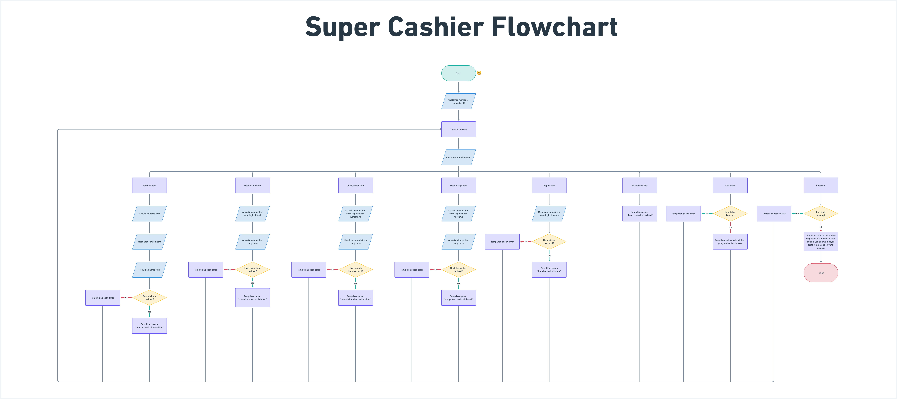

# Super Cashier
Super Cashier is a Final Project as part of Software and Data Engineering course in PACMANN. This project for **Introduction to Software and Data Engineering with Python I & II** modules.
# Table of Contents
- [Super Cashier](#super-cashier)
- [Table of Contents](#table-of-contents)
	- [Background](#background)
	- [Requirements](#requirements)
	- [Flowchart](#flowchart)
	- [Code Explanation](#code-explanation)
	- [Test Case Results](#test-case-results)
	- [Conclusion](#conclusion)

[Back to Table of Contents ⬆️](#table-of-contents)

## Background
Andi adalah seorang pemilik supermarket besar di salah satu kota di Indonesia. Andi memiliki rencana untuk melakukan perbaikan proses bisnis, yaitu Andi akan membuat sistem kasir yang self-service di supermarket miliknya dengan harapan 
- Customer bisa langsung memasukkan item yang dibeli, jumlah item yang dibeli, dan harga item yang dibeli dan fitur yang lain.
- Customer yang tidak berada di kota tersebut bisa membeli barang dari supermarket tersebut.

[Back to Table of Contents ⬆️](#table-of-contents)

## Requirements
1. Customer dapat membuat ID Transaksi
   - Dengan membuat object dari function: `trnsct_123 = transaction()`
2. Customer dapat memasukkan nama item, jumlah item, dan harga item
   - Masukkan item yang ingin dibeli: `add_item([<nama item>, <jumlah item>, <harga per item>])`
3. Jika customer salah memasukkan nama item atau jumlah item atau harga item tetapi tidak ingin menghapusnya, customer dapat melakukan:
   -  Update nama item dengan method: `update_item_name(<nama item>, <update nama item>)`
   -  Update jumlah item: `update_item_qty(<nama_item>, <update jumlah item>)`
   -  Update harga item: `update_item_price(<nama_item>, <update harga item>)`
4. Jika customer batal membeli, customer dapat melakukan: 
   - Menghapus salah satu item: `delete_item(<nama item>)`
   - Menghapus semua transaksi sekaligus atau reset transaksi: `reset_transaction()`
5. Customer sudah selesai dengan berbelanja online nya, tetapi Customer masih ragu apakah harga barang dan nama barang yang diinput sudah benar. Bisa saja Customer melakukan kesalahan dalam melakukan input, semisal sudah melakukan input harga barang tetapi lupa untuk input nama barangnya. Andi bisa menggunakan method `check_order()`. Terdapat ketentuan:
   - Akan mengeluarkan pesan “Pemesanan sudah benar” (bebas bisa dengan message yang lain) jika tidak ada kesalahan input
   - Akan mengeluarkan pesan “Terdapat kesalahan input data” jika terjadi kesalahan input
   - Keluarkan output transaksi atau pemesanan apa saja yang sudah dibeli
6. Setelah melakukan pengecekan, Customer bisa menghitung total belanja yang sudah dibeli. Andi bisa menggunakan method check_out(). Pada supermarket ini ternyata terdapat ketentuan:
   - Jika total harga per item Andi diatas Rp 200.000 maka akan mendapatkan diskon 5%
   - Jika total harga per item Andi diatas Rp 300.000 maka akan mendapatkan diskon 6%
   - Jika total harga per item Andi diatas Rp 500.000 maka akan mendapatkan diskon 7%
   - Total pembelian hanya ditampilkan pada method check_out(), namun tidak di simpan di dalam database
7. Setiap kali method check_out() dijalankan, data transaksi dimasukkan ke dalam sqlite database pada tabel transaction menggunakan fungsi `insert_to_table(<source_data>)`
   - Kolom yang disimpan pada database
        - no_id 			: nomer id (auto increment)
     	- nama_item		: nama barang yang dibeli
   		- jumlah_item		: jumlah barang yang dibeli
   		- harga			: harga barang 
   		- total_harga		: total harga (jumlah item * harga)
   		- diskon			: potongan harga
   		- harga_diskon		: harga item setelah diskon

[Back to Table of Contents ⬆️](#table-of-contents)

## Flowchart

[Back to Table of Contents ⬆️](#table-of-contents)

## Code Explanation
[Back to Table of Contents ⬆️](#table-of-contents)

## Test Case Results
[Back to Table of Contents ⬆️](#table-of-contents)

## Conclusion
[Back to Table of Contents ⬆️](#table-of-contents)